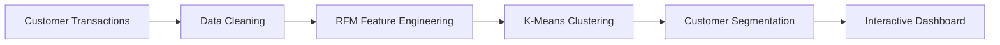

<div align="center">

# 👥 CustomerIQ

### AI-Powered Customer Segmentation & RFM Analytics Platform

*An end-to-end customer analytics platform that combines RFM analysis, K-Means clustering, and interactive visualizations to identify high-value customers, uncover purchasing behavior, and support data-driven marketing strategies.*


</div>

---

# 📖 Overview

Understanding customer behavior is essential for increasing retention, improving marketing efficiency, and maximizing customer lifetime value.

CustomerIQ demonstrates a complete customer analytics workflow by combining RFM (Recency, Frequency, Monetary) analysis with machine learning clustering techniques to segment customers based on purchasing behavior.

The platform transforms raw transactional data into meaningful customer groups, enabling businesses to personalize marketing campaigns and improve customer engagement through data-driven decision making.

---

# ✨ Core Features

## 👥 Customer Segmentation

- RFM Analysis
- Customer Lifetime Value Assessment
- Behavioral Segmentation
- Purchase Pattern Analysis

---

## 🤖 Machine Learning

- K-Means Clustering
- Customer Group Discovery
- Cluster Visualization
- Segment Comparison

---

## 📊 Interactive Dashboard

Explore customer insights through:

- KPI Cards
- Customer Segment Distribution
- RFM Score Visualization
- Cluster Analysis
- Interactive Filters
- Customer Rankings

---

## 📈 Marketing Intelligence

Identify:

- VIP Customers
- Loyal Customers
- At-Risk Customers
- New Customers
- High-Spending Customers
- Inactive Customers

---

# 🏗 Analytics Workflow



---

# 📊 Analytics Included

### 👥 Customer Analytics

- Customer Lifetime Value
- Purchase Frequency
- Monetary Contribution
- Customer Activity

---

### 📈 RFM Analysis

- Recency Scoring
- Frequency Scoring
- Monetary Scoring
- Overall Customer Ranking

---

### 🤖 Machine Learning

- K-Means Clustering
- Customer Similarity
- Segment Discovery
- Cluster Evaluation

---

### 📣 Marketing Insights

- Customer Retention Opportunities
- High-Value Customer Identification
- Reactivation Candidates
- Personalized Marketing Segments

---

# 🛠 Technology Stack

| Category | Technology |
|-----------|------------|
| Programming | Python |
| Data Analysis | Pandas, NumPy |
| Machine Learning | Scikit-learn |
| Clustering | K-Means |
| Visualization | Plotly, Matplotlib |
| Dashboard | Streamlit |

---

# 📂 Repository Structure

```text
CustomerIQ/

├── dashboard/
│   └── app.py
│
├── data/
│   └── customer_data.csv
│
├── src/
│   ├── preprocessing.py
│   ├── segmentation.py
│   ├── clustering.py
│   └── visualization.py
│
├── main.py
├── requirements.txt
└── README.md
```

---

# 🚀 Getting Started

Clone the repository

```bash
git clone https://github.com/your-username/customeriq.git
```

Install dependencies

```bash
pip install -r requirements.txt
```

Run the project

```bash
python main.py
```

Launch the dashboard

```bash
streamlit run dashboard/app.py
```

---

# 🎯 Skills Demonstrated

- Customer Analytics
- RFM Analysis
- Customer Lifetime Value (CLV)
- K-Means Clustering
- Feature Engineering
- Data Visualization
- Interactive Dashboard Development
- Machine Learning
- Marketing Analytics
- Business Intelligence

---

# 💼 Business Applications

CustomerIQ can support:

- 🎯 Customer Segmentation
- 📣 Personalized Marketing
- 💰 Customer Lifetime Value Analysis
- 🔄 Customer Retention Strategies
- 📈 Marketing Campaign Optimization
- 🛍 Customer Behavior Analysis
- 📊 Executive Business Reporting

---

# 💡 Why This Project?

Not all customers contribute equally to business growth. CustomerIQ demonstrates how customer transaction data can be transformed into meaningful behavioral segments using RFM analysis and machine learning.

The project showcases practical skills in customer analytics, unsupervised learning, business intelligence, and interactive visualization, helping organizations identify valuable customer groups and develop targeted retention and marketing strategies.
